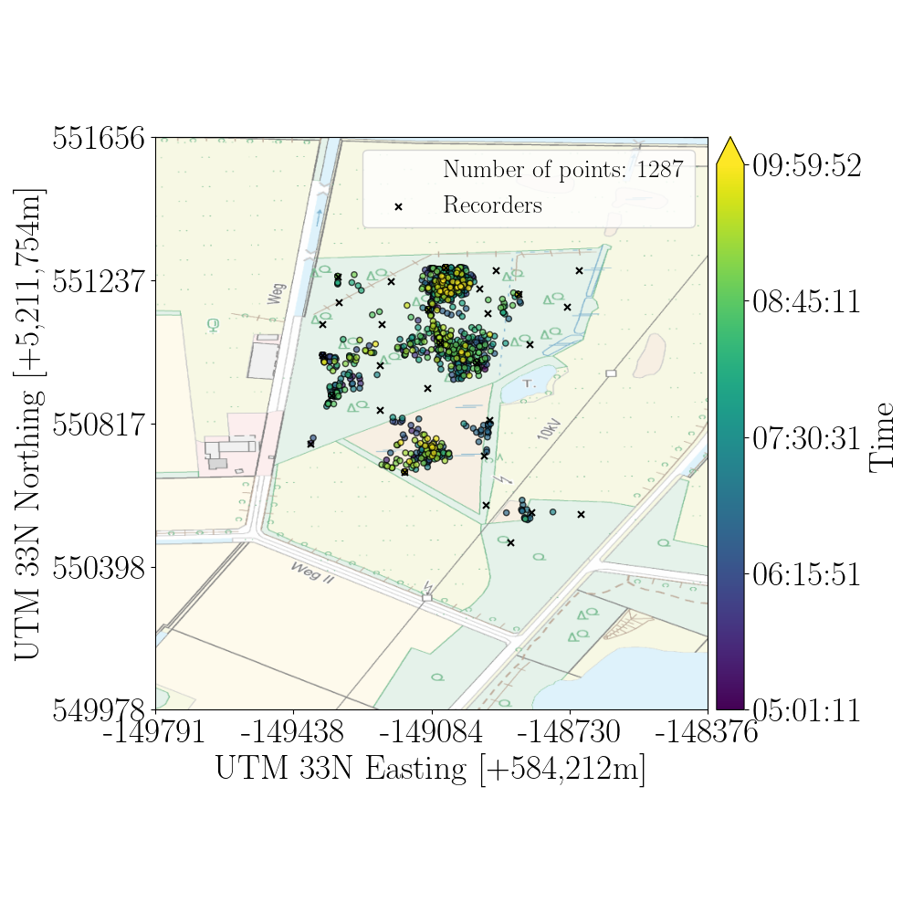

<div align="center">
  <h1>Territorial Acoustic Species Estimation (TASE)</h1>
  <p>
    An algorithm for estimating territorial individuals of acoustic species  
    using distributed sensor networks and AI-based classifiers (e.g. BirdNET)
  </p>
  
</div>


---

## Introduction


TASE (“Territorial Acoustic Species Estimation”) extracts spatial and territorial patterns of sound-producing species from recordings collected by a network of autonomous sensors. By combining low-cost recording units with AI classifiers, TASE automates the estimation of individual territories—matching or even exceeding the accuracy of manual expert surveys.

This repository hosts:
- The core TASE algorithm  
- Example scripts and minimal usage workflows  
- Pre- and post-processing utilities for sensor metadata and classifier outputs  

We aim to keep this repo up to date and user-friendly so that researchers without a CS background can easily apply TASE to their own acoustic deployments.

---

## Citation

If you use TASE in your research, please cite:

```bibtex
@article{Bruggemann2025,
  author  = {Brüggemann, Leonhard and Otten, Daniel and Sachser, Frederik and Aschenbruck, Nils},
  title   = {Territorial Acoustic Species Estimation using Acoustic Sensor Networks},
  journal = {SSRN Electronic Journal},
  year    = {2025},
  month   = {January 8},
  doi     = {10.2139/ssrn.5113322},
  url     = {https://ssrn.com/abstract=5113322}
}
```

---

## How to Use
1. Clone the repository:
    
```
git clone https://github.com/sys-uos/TASE.git
cd TASE
```

2. Install the requirements (see ```requirements_Ubuntu20.04_Python3.8.txt ```or  ```requirements_Ubuntu24.04_Python3.12.txt ```) :

 ```
pip install -r requirements_Ubuntu20.04_Python3.8.txt
# or
pip install -r requirements_Ubuntu24.04_Python3.12.txt
```

3. pip install -r requirements_Ubuntu20.04_Python3.8.txt
# or
pip install -r requirements_Ubuntu24.04_Python3.12.txt

---


## Minimal Working Example

This example estimates territories of Sylvia atricapilla from a 10-minute subset of real deployment data.

1. **Initialize the species**

```
   spec = Sylvia_atricapilla()
```

2. **Load and convert node locations**
```
    node_locations = parse_audiomoth_locations(csv_node_locations)
   location_data_list = convert_wgs84_to_utm(node_locations, zone_number=32, zone_letter='N')
```

3. **Define deployment window**
```
    berlin_tz = pytz.timezone("Europe/Berlin")
    dt_start = datetime.datetime(2023, 6, 3, 9, 0, 0)  # 3rd June 2023, 09:00 in Berlin (CEST)
    dt1_aware = berlin_tz.localize(dt_start)  # Make it timezone-aware
    dt_end = datetime.datetime(2023, 6, 3, 10, 0, 0)  # 3rd June 2023, 10:00 in Berlin (CEST)
    dt2_aware = berlin_tz.localize(dt_end)
    deployment_start, deployment_end = dt1_aware.timestamp(), dt2_aware.timestamp()
```

4. **Parse classifier outputs**
```
    if not os.path.exists(out_pkl_file):
        dict_devid_df = parse_classifications_as_dir(dir_path=dir_classification)  # key: devid, value: dataframe
        dict_devid_df = add_date_to_classification_dataframe(dict_devid_df, deployment_start)
        dict_devid_df = check_and_fill_missing_entries(dict_devid_df)  # there shouldn't be any, but make sure no gaps exist
        save_classification_data(dict_devid_df, out_pkl_file)
```

5. **Configure TASE parameters**

```
    params = Parameters(
        threshold_R=0.8,
        threshold_B=0.1,
        TS_delta=0.2,
        threshold_T=spec.max_root_2_leaf_distance(),
        d_max=100,
    )
```

6. **Build the spatio-temporal graph and run TASE**

```
    graph = CustomizedGraph()  # by default, nothing happens here
    graph.add_nodes_with_coordinates(device_list=node_locations_utm)  # add nodes, including their coordinates
    graph.add_classifications_for_each_node(pkl_file=out_pkl_file)  # each node contains a list of their classification results

    territorial_subgraphs_all = {}  # key: epoch-timestamp, value: territorial subgraphs
    for ts in range(int(deployment_start), int(deployment_end)-7, 1):  #  5 s gap between recordings + 3 s BirdNET gap = 8s time of last classification window
        start_dt = datetime.datetime.fromtimestamp(ts, tz=berlin_tz)
        end_dt = datetime.datetime.fromtimestamp(ts+3, tz=berlin_tz)  # the value 3 refers to 3 seconds, which is BirdNET's window
        print(f"Apply TASE on period from {start_dt} to {end_dt}")
        graph.init_graph(directedGraph=True)  # init the graph with the locations
        graph.set_weight_to_timestamp(ts)  # set the weights of the node to a specific window
        graph.delauny(e_delta=0.2)  # perform delauny algorithm, add edge only if condition is met
        graph.remove_long_edges(d_max=params.d_max)  # remove edges that exceed 100m
        # 6.3 Apply TASE-Algorithm to extract territorial subgraphs
        territorial_subgraphs = graph.tase(threshold_R=params.threshold_R,
                                           threshold_B=params.threshold_B,
                                           threshold_T=params.threshold_T,
                                           TS_delta=params.TS_delta)
       # compute centroids
        for root in territorial_subgraphs:
            territorial_subgraphs[root]['location'] = calculate_weighted_centroid_from_nxgraph(territorial_subgraphs[root]['TS'])
        territorial_subgraphs_all[ts] = territorial_subgraphs
```

7. **Visualize territories**
```
dict_ts_centroids = extract_locations(territorial_subgraphs_all)
viewer = WMSMapViewer()
viewer.add_and_convert_pointcloudUTM_2_pointcloudPIXEL(dict_ts_centroids, zone_number=32, zone_letter='N')
viewer.add_node_locations(location_data_list)
viewer.display_with_heatmap(font_size=16, kde_bw_param=0.2, vmax=0.0001, figpath="./example/example_figure.pdf")
```

<div align="center">
   
   
</div>

---

## Adapting TASE for custom Deployment

The minimal working example above is a good reference for adapting TASE to a custom deployment. The main steps need to be adjusted based on specific requirements. 
Experimenting with different parameters when applying and visualizing the results is recommended.

1. **Create a Custom Species Class**: Define a new class that inherits from core.species.Species and set the required attributes:
```
class SomeCustomClass(core.species.Species):
    def __init__(self):
        self.lat_name = "Nomen Consuetudinarium"  # Latin Name
        self.eng_name = "Custom Name"            # English Name
```

2. **Parse Location Data**: Ensure the location data is formatted as a list of Recording_Node objects (List[Recording_Node]).


3. **Calculate Deployment Start and End**: Convert the deployment's start and end times into epoch timestamps.


4. **Parse Classification Results**: Convert the classification results into a pandas DataFrame for processing.


    5. **Set TASE Parameters**: Configure the parameters specific to your deployment to optimize performance.


6. **Apply TASE Across the Deployment Duration**: Run the TASE algorithm to estimate species territories over the entire deployment period.

---

## Integrate Data used in Publication for Replication
The data used in the related paper have been processed using the university service. Unfortunately, the original directory structure could not be preserved. Instead, the data are provided as a split .zip archive that must be recombined (refer to the provided link for instructions).

Once the unzipped directory is available, e.g., on an external drive, it can be easily integrated by creating a symbolic link. In Linux, this can be done by executing the following command within the cloned Github repository: ln -s path/to/unzipped_dir ./data

Data available at: [Link](TODO)

---

## Contact
For questions or issues, please contact [brueggemann@uni-osnabrueck.de].
